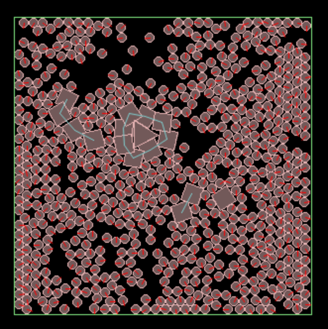

# Simulated Autopoiesis in Liquid Automata

Living systems cannot be understood separately from they environment they live in. They are organised in a causal circular process of becoming, and it is this very circularity that is a necessity for living – autopoietic - systems. An autopoitetic system is alive if it produces itself in the physical space, based on interactions between physical elements that go on to produce new physical elements necessary for the regeneration of the system. A living system is a self-referential domain of interactions in the physical space, generally a network of 'chemical' relationships. However, there are many kinds of chemical networks that aren't alive, consider a chemical explosion which exhibits a runaway chain reaction of positive feedback. The signature of life is the emergence of a structure that distinguishes self from non-self, closing it off from its environment. This closure emerges from, and is dynamically and homeostatically maintained by, the underlying organisation.

Simluated autopoiesis is a demonstration of how autopoiesis works and enables us to study simpler autopoietic systems not found in nature. The system is defined as a network of simulated chemical reactions, bathed in a liquid substrate that provides the raw materials from which the system builds itself. The seed is a catalytic agent (triangle) that transforms the substrate (circles) into its structural building blocks (squares). These are able to self-assemble (blue links), forming a boundary around the catalyst, analogous to a cell wall. According to Maturana, these simulations are not themselves alive because software operates in a virtual rather than a physical space. However, even they are not alive, they are still autonomous, identity-preserving systems in their own right.

This is a 2D particle simulation with additional rules about how particle state changes on contact with other particles. Unlike cellular automata, there is no fixed grid, just particles moving about and colliding with each other. By analogy with cellular automata, we call this a 'Liquid Automaton'. This system is based on just three rules, defined below, based on a _cellular_ automaton devised by Varela. 

1. composition: K + 2S -> K + L
2. concatenation: L0-L1- ... -Ln + L -> L0-L1- ... -Ln+1
3. disintegration:  L -> 2S

Where:
* K - catalyst
* S - substrate
* L - link

Composition only occurs when a catalyst is in contact with a pair of substrate particles, which are fused together to form a link particle. Concatenation enables the self-assembly of the boundary. Link are able to make up to two connections, and when two links collide that are able to do so, they form a bond between them (shown as a blue line). As these links are being formed around the catalyst, it's likely that the bonded links will close the circle, forming a continuous boundary around the catalyst. Links are also subject to decay, and may spontaneously disintegrate back into a pair of substrate particles. In this experiment, a single catalyst particle is introduced at the beginning, which is not subject to disintegration.

## Installation

1. Install [PyBox2D](https://github.com/pybox2d/pybox2d):
  * conda create -n pybox2d -c conda-forge python=3.6 pybox2d
  * conda activate pybox2d
  * pip install pygame
2. Download the python code in this GitHub: auto.py
3. Run auto.py:
  * python -m auto --backend=pygame 

Humberto Maturana, Francisco J. Varela, _Autopoiesis and Cognition_, D. Reidel Publishing Co., 1972.  
Francsico Varela, _Principles of Biological Autonmy_, North Holland, 1979.  
Hordijk, W., Steel, M. _Autocatalytic sets and boundaries_, J Syst Chem 6, 1, 2015.  

